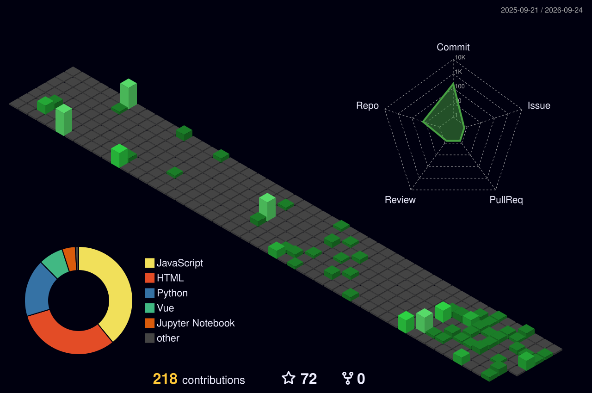

<!-- ═════════════════════════ HEADER ═════════════════════════ -->

  

  
  
  
  

<!-- ═════════════════════ ASCII (GitAscii) ═════════════════════
  1. Go to https://gitascii.com and sign in with GitHub
  2. Build your layout (ASCII avatar from your photo, widgets)
  3. Paste the generated URL below in place of YOUR_GITASCII_URL,
     uncomment the block, and delete the <pre> fallback
-->
<!--

  

-->

<pre>
██████╗ ██╗███████╗██╗    ██╗ █████╗ 
██╔══██╗██║██╔════╝██║    ██║██╔══██╗
██████╔╝██║███████╗██║ █╗ ██║███████║
██╔══██╗██║╚════██║██║███╗██║██╔══██║
██████╔╝██║███████║╚███╔███╔╝██║  ██║
╚═════╝ ╚═╝╚══════╝ ╚══╝╚══╝ ╚═╝  ╚═╝
</pre>

---

###  About Me

<table>
<tr>
<td width="60%" valign="top">

Full-Stack Developer specializing in **Generative AI, Agentic AI** and modern web applications. I build production-grade **AI voice agents, RAG pipelines and LLM-powered apps** with Python, FastAPI, LangChain, LangGraph, React, Next.js and Node.js.

- 🤖 AI agent orchestration, prompt engineering, vector databases and **MCP**
- ⚙️ REST APIs, WebSockets, JWT auth, webhooks and microservices
- 🚀 Deploying scalable full-stack apps to the cloud
- 🎓 BCA, Lakshya Institute of Technology, Bhubaneswar

</td>
<td width="40%" align="center" valign="middle">
  
</td>
</tr>
</table>

---

###  Tech Stack

  

<table>
  <tr>
    <td align="center" width="170"><b>Languages</b></td>
    <td></td>
  </tr>
  <tr>
    <td align="center"><b>Frontend</b></td>
    <td>
     </td>
  </tr>
  <tr>
    <td align="center"><b>Backend</b></td>
    <td>
     
    
    
    </td>
  </tr>
  <tr>
    <td align="center"><b>AI &amp; GenAI</b></td>
    <td>
    
    
    
    
    
    </td>
  </tr>
  <tr>
    <td align="center"><b>Databases</b></td>
    <td></td>
  </tr>
  <tr>
    <td align="center"><b>Cloud &amp; DevOps</b></td>
    <td>
     </td>
  </tr>
  <tr>
    <td align="center"><b>Tools</b></td>
    <td>
     
    </td>
  </tr>
</table>

---

###  Achievements

- 🥇 **1st Place, College Project Expo:** AI agents for an ERP system (FastAPI, LangGraph, ChromaDB) plus the landing website
- 🥇 **1st Place, College Hackathon:** Led the backend of a code practice platform (Monaco Editor, Piston API, FastAPI, React)

---

###  GitHub Analytics

<!-- 3D graph generated daily by .github/workflows/profile-3d.yml -->
<picture>
  <source media="(prefers-color-scheme: dark)" srcset="profile-3d-contrib/profile-night-green.svg" />
  <source media="(prefers-color-scheme: light)" srcset="profile-3d-contrib/profile-green-animate.svg" />
  
</picture>

  

  

