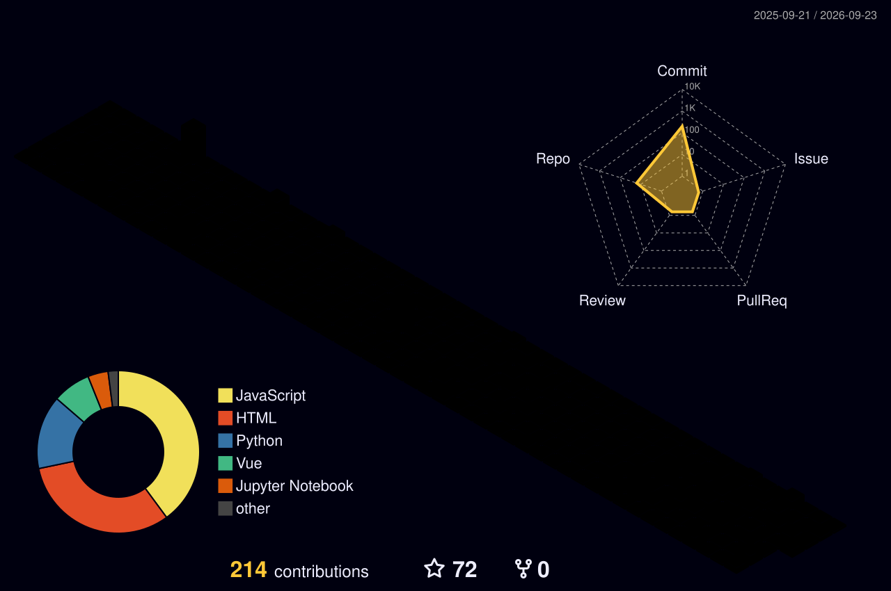

<!-- ═════════════════════════ HERO ═════════════════════════ -->
<p align="center">
  
</p>

<p align="center">
  <a href="https://github.com/Biswa-source45">
    
  </a>
</p>

<p align="center">
  
  <a href="https://github.com/Biswa-source45?tab=followers"></a>
</p>

<!-- ═════════════════════ ASCII (GitAscii) ═════════════════════
  1. Go to https://gitascii.com and sign in with GitHub
  2. Build your layout: upload your photo → ASCII avatar, add terminal / stats widgets
  3. Copy the generated URL and paste it below (replace YOUR_GITASCII_URL)
  4. Delete the fallback <pre> block after that
-->
<!--
<p align="center">
  
</p>
-->

<div align="center">
<pre>
██████╗ ██╗███████╗██╗    ██╗ █████╗ 
██╔══██╗██║██╔════╝██║    ██║██╔══██╗
██████╔╝██║███████╗██║ █╗ ██║███████║
██╔══██╗██║╚════██║██║███╗██║██╔══██║
██████╔╝██║███████║╚███╔███╔╝██║  ██║
╚═════╝ ╚═╝╚══════╝ ╚══╝╚══╝ ╚═╝  ╚═╝
  ~/biswa $ whoami → full-stack dev in the making
</pre>
</div>

---

##  About Me

<table>
<tr>
<td width="58%" valign="top">

```js
const biswa = {
  role:      "Full-Stack Developer (in progress 🚧)",
  frontend:  ["HTML", "CSS", "JavaScript", "React"],
  backend:   ["Django", "Django REST Framework"],
  data:      ["MySQL", "Excel", "Power BI", "Pandas", "NumPy"],
  exploring: "Machine Learning 🤖",
  motto:     "Always learning, always building 🚀",
};
```

- 🎨 I craft **responsive, dynamic UIs** with React
- ⚙️ Building **robust, scalable APIs** with Django + DRF
- 📊 Turning raw data into insights with **Pandas & Power BI**
- 🤝 Open to collaborating on **web & data projects**

</td>
<td width="42%" align="center" valign="middle">
  
</td>
</tr>
</table>

---

##  Tech Stack

<p align="center">
  
</p>

<div align="center">

**Languages**<br/>


**Frontend & Design**<br/>


**Backend & Databases**<br/>


**Deploy & Tools**<br/>


**Data & ML**<br/>


</div>

---

##  GitHub Analytics

<div align="center">


</div>

### 🧊 3D Contribution Skyline

<!-- Generated daily by .github/workflows/profile-3d.yml -->
<picture>
  <source media="(prefers-color-scheme: dark)" srcset="profile-3d-contrib/profile-night-rainbow.svg" />
  <source media="(prefers-color-scheme: light)" srcset="profile-3d-contrib/profile-season-animate.svg" />
  
</picture>

### 🏆 Trophies

<p align="center">
  
</p>

---

##  Let's Connect

<p align="center">
  <a href="https://www.linkedin.com/in/biswabhusan-sahoo-22b704292/"></a>
  <a href="https://x.com/Biswa_source"></a>
  <a href="https://instagram.com/ll._b_i_s_w_a_.ll"></a>
  <a href="https://discord.gg/biswa_source45"></a>
  <a href="mailto:biswapvt506@gmail.com"></a>
</p>

<p align="center">
  
</p>

<p align="center">
  
</p>
